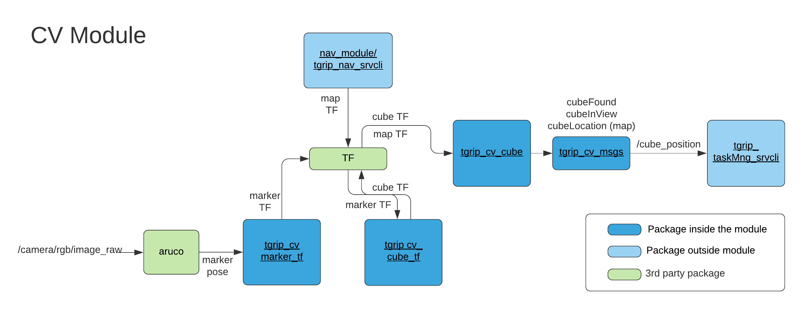

# CV Module Info

This module consisting of 4 packages, detects the location of the cube covered with aruco markers. The current version of the module works on a cube covered with 2"x2" aruco markers #0 ,#1, and #2 from Aruco Original library. To use the module do:

```cpp
roslaunch cube_location find_cube.launch
```


# Dependencies / Requirements

External packages can be installed with sudo apt-get install ros-kinetic-{package_name}

- [aruco_ros](http://wiki.ros.org/aruco_ros)

Internal tgrip packages:

- tgrip_description
- tgrip_nav_srvcli

The robot description and mapping nodes must be running in order to successfully launch find_cube.launch as the cube location is relative to the map that is found through the navigation package.

Alternatively, to just get a tf of the cube's center without doing any mapping etc. you can run:

```cpp
roslaunch cube_tf_broadcast all_tag_broadcaster.launch world_name:={name_of_frame_that_exists}
```

# Diagram of interactions between packages



# Package Description

## tgrip_cv_marker_tf

Launches aruco, receives specified marker's (#X) stamped pose and broadcasts TF of the marker as /aruco_single_X

## tgrip_cv_cube_tf

Launches tgrip_cv_marker_tf for 3 aruco markers, listens to marker TF, finds the pose of the cube by taking an offset along y axis and broadcasts the TF of the center of the cube as /cube

## tgrip_cv_cube

Launches tgrip_cv_cube_tf, listens to /cube relative to /map. The node publishes message in /cube_position where it monitors whether the cube was found (=detected at least once), currently in camera view, and the aggregate location of 10 sightings of the cube relative to the map.

## tgrip_cv_msgs

message published by tgrip_cv_cube
